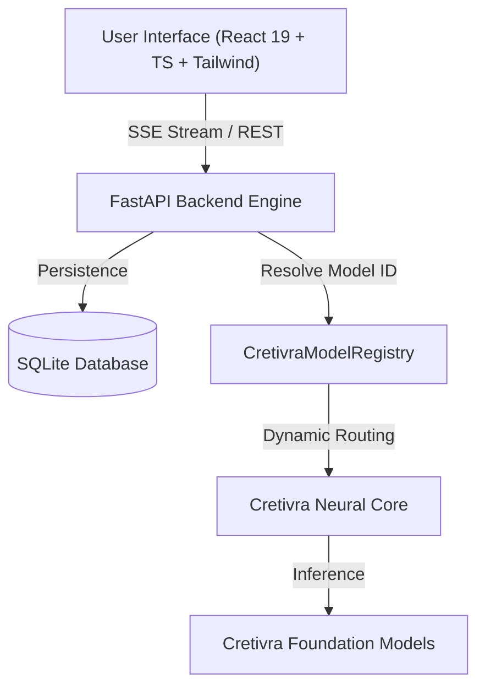

# ASURA AI by Cretivra

> **"Your AI. Your data. Your control."**  
> *Think beyond.*

Asura AI by Cretivra is a serious, frontier and local-first, privacy-respecting AI platform powered by the Cretivra Engine with an abstraction layer for model registry branding, real-time response streaming, document attachment intelligence, persistent history, and responsive user experience.

---

## 🎨 Frontend Stack, Components & Design System

### **1. Technology Stack**
- **Framework**: React 19 + TypeScript
- **Build Tool**: Vite 8
- **Styling**: Tailwind CSS v4
- **Icons**: Lucide React (`lucide-react`)
- **Markdown & Math**: `react-markdown`, `remark-gfm`, `rehype-highlight`, `katex`
- **Utilities**: `clsx`, `tailwind-merge`

---

### **2. Frontend Components Architecture**

| Component | Path | Description |
| :--- | :--- | :--- |
| **`App.tsx`** | `src/App.tsx` | Root layout, header bar, model switcher, navigation & state orchestrator |
| **`CretivraLogo`** | `src/components/common/CretivraLogo.tsx` | Vector SVG infinity network logo component |
| **`LandingScreen`** | `src/components/chat/LandingScreen.tsx` | Centered hero greeting ("What can I help with today?") & 2x2 prompt cards |
| **`ChatMessage`** | `src/components/chat/ChatMessage.tsx` | Full-width message feed with Markdown, code copy action, edit prompt, regenerate |
| **`ChatComposer`** | `src/components/chat/ChatComposer.tsx` | Multiline expanding input box, file attachment chips, model selector, stop button |
| **`DragAndDropOverlay`** | `src/components/chat/DragAndDropOverlay.tsx` | Visual drag-and-drop file upload zone |
| **`Sidebar`** | `src/components/sidebar/Sidebar.tsx` | Collapsible sidebar with conversation history grouped by date (Today, Yesterday, 7 Days, Older) |
| **`SearchModal`** | `src/components/sidebar/SearchModal.tsx` | Local instant conversation search modal (`⌘K`) |
| **`ModelSelector`** | `src/components/model-selector/ModelSelector.tsx` | Cretivra Model Registry selector pill hiding raw underlying model names |
| **`HealthModal`** | `src/components/settings/HealthModal.tsx` | System health check dashboard (`/health`) |
| **`SettingsModal`** | `src/components/settings/SettingsModal.tsx` | System settings for temperature, max context, theme, and data clearing |
| **`ShareModal`** | `src/components/settings/ShareModal.tsx` | Conversation sharing snapshot modal |
| **`ImageStudioModal`** | `src/components/image-studio/ImageStudioModal.tsx` | Full-featured AI Image Generation Studio with aspect ratios, styles, and prompt enhancement |

---

### **3. Color Palette Tokens**

#### **Background Surfaces (Dark Obsidian Theme)**
- **Base Background**: `#060911` / `rgb(6, 9, 17)`
- **Sidebar & Modals**: `#0d121f` / `rgb(13, 18, 31)`
- **Elevated Cards**: `#151c2e` / `rgb(21, 28, 46)`
- **Borders & Dividers**: `#232d45` / `rgb(35, 45, 69)`

#### **Brand Accents & Gradients**
- **Electric Cyan**: `#06b6d4` (Logo glow, active tab highlights, primary CTA)
- **Cyber Blue**: `#3b82f6` (Midpoint gradient fill, link text, code icons)
- **Vibrant Violet**: `#8b5cf6` (Deep reasoning badge, purple ambient glow)
- **Royal Purple**: `#a855f7` (Creative studio badges, category tags)

#### **Status & Functional Indicators**
- **Emerald Green**: `#10b981` (Connected status dot, success state, Python/Code badges)
- **Amber Gold**: `#f59e0b` (Warning/Offline status dot, fast model category tag)
- **Rose Red**: `#f43f5e` (Error banner, stream stop generation button)

---

### **4. Visual Effects & Animations**

- **Animated Logo Pulse (`animate-logo-pulse`)**: Pulses cyan-violet drop-shadow glow.
- **Animated Shimmer Text (`gradient-text-animated`)**: Animated multi-color text shift (`#38bdf8` -> `#818cf8` -> `#c084fc`).
- **Ambient Glow Mesh (`animate-ambient-glow`)**: Soft background radial orb translation.
- **Glassmorphism Panel (`glass-panel`)**: `backdrop-filter: blur(16px)` dark glass container.
- **Gradient Border Glow (`gradient-border-glow`)**: 1px border gradient mask for interactive cards.

---

## 🏗 System Architecture



---

## 🚀 Quickstart Guide

### Prerequisites
- [Python 3.10+](https://www.python.org/)
- [Node.js 18+](https://nodejs.org/)
- Cretivra AI Engine runtime

### 1. Initialize Cretivra Neural Core
```bash
# Verify Cretivra models registry:
python -m app.services.model_registry
```

### 2. Configure Backend
```bash
# Create environment file
cp .env.example .env

# Set up Python virtual environment
python -m venv backend/venv

# Activate venv:
# Windows:
.\backend\venv\Scripts\activate
# Linux/macOS:
source backend/venv/bin/activate

# Install backend dependencies
pip install -r backend/requirements.txt

# Run FastAPI backend server (Port 8000)
$env:PYTHONPATH="backend"
python -m uvicorn app.main:app --reload --port 8000
```

### 3. Configure Frontend
```bash
cd frontend
npm install
npm run dev
```
Open your browser at `http://localhost:5173`.

---

## 🧪 Running Tests

```bash
$env:PYTHONPATH="backend"
.\backend\venv\Scripts\pytest backend/tests
```

All unit & integration tests verify model resolution, health check, conversation persistence, streaming logic, message editing, regeneration, file validation, and settings.

---

## 🐳 Docker Deployment

```bash
docker-compose up --build
```
Access Cretivra AI at `http://localhost:8000`.

---

## 📚 Project Documentation

- [User Authentication & Data Storage Architecture](docs/data_security.md)
- [100% Free ($0.00) AI Providers Guide](docs/zero_cost_ai.md)
- [Frontier Intelligence & Neural Optimization Guide](docs/model_training.md)
- [100% Free Cloud Production Hosting (Vercel + Render + Supabase + Colab)](docs/cloud_architecture.md)
- [Production Hosting & Deployment Guide](docs/hosting_guide.md)
- [Frontend Design System & Components](docs/design_system.md)
- [Architecture & Data Flow](docs/architecture.md)
- [API Reference](docs/api.md)
- [Model Registry Mapping](docs/models.md)
- [Cretivra Engine Guide](docs/cretivra_engine.md)
- [Development Guide](docs/development.md)
- [Multi-Version Roadmap](docs/roadmap.md)
