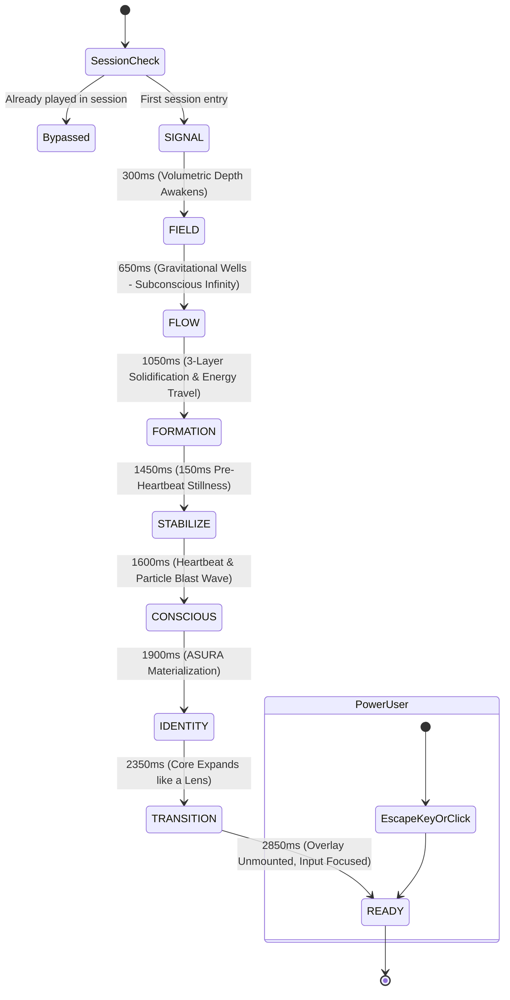

# ASURA AI — Cinematic Intelligence Awakening V2 Specification

> **Document Version:** 2.0.0 (The Awakening)  
> **Brand Identity:** ASURA AI by CRETIVRA  
> **Live Production:** [https://asura-ai.cretivra.com](https://asura-ai.cretivra.com)  
> **Architecture Directory:** [`frontend/src/components/opening/`](file:///c:/Users/suhas/OneDrive/Desktop/cretivra%20ai/frontend/src/components/opening/)

---

## 1. Executive Creative Directive — "THE AWAKENING"

The **Asura AI Opening Animation V2** discards conventional splash screens, loading spinners, and logo fade-ins. Instead, the sequence stages an authentic, continuous, and physical **intelligence awakening**.

The authentic **CRETIVRA logo is treated as the visual DNA of Asura's intelligence core**.

The sequence flows as a singular, morphing transformation:
```text
VOID ──▶ SIGNAL ──▶ FIELD ──▶ FLOW ──▶ STRUCTURE ──▶ CONSCIOUSNESS ──▶ ASURA ──▶ INTERFACE
```

There are no segmented cutoffs or disjointed stages. Every frame naturally emerges from the kinetic state before it.

---

## 2. Duration & Timeline Choreography

**Total Sequence Duration:** **2.85 seconds** (Fast-track returning visit: **0.65 seconds**).

```text
[0.00s – 0.30s]  SCENE 01 — THE VOID (Microscopic Signal Heartbeat)
       │
[0.30s – 0.65s]  SCENE 02 — THE FIELD (Volumetric 3D Particle Awakening)
       │
[0.65s – 1.05s]  SCENE 03 — PROCEDURAL FLOW (Subconscious Infinity Wells)
       │
[1.05s – 1.45s]  SCENE 04 — ENERGY THREADS & PATH TRAVEL (3-Layer Logo Solidification)
       │
[1.45s – 1.60s]  SCENE 05A — THE STILLNESS (150ms Pre-Heartbeat Deceleration)
       │
[1.60s – 1.90s]  SCENE 05B — THE CONSCIOUSNESS HEARTBEAT (Environmental Particle Displacement)
       │
[1.90s – 2.35s]  SCENE 06 — ASURA IDENTITY MATERIALIZATION (Light Field & Letterform Sweep)
       │
[2.35s – 2.85s]  SCENE 07 — THE WORLD OPENS (Camera Lens Core Expansion & Workspace Reveal)
       │
[2.85s+]         SCENE 08 — READY STATE (Zero Delay, Composer Auto-Focused)
```

---

## 3. Scene Breakdown & Visual Choreography

### Scene 01 — The Void (0.00s – 0.30s)
* **Canvas**: Pristine light backdrop (`#FFFFFF` with subtle radial atmospheric tone).
* **Signal**: A microscopic luminous point ($0.8\text{px} - 1.5\text{px}$) awakens at the exact viewport center.
* **Heartbeat Breathing**: The point expands and contracts gently:
  $$\text{scale: } 0.4 \longrightarrow 1.0 \longrightarrow 0.7$$
  Soft dual-layer cyan and violet bloom emanates from the focal point.

### Scene 02 — The Field (0.30s – 0.65s)
* **Volumetric Presence**: Particles do not explode; they materialize as if an invisible field has suddenly become illuminated.
* **Density**: 68 volumetric particles (desktop) / 38 (mobile).
* **Layer Stratification**:
  - **Layer A (Fine)**: $0.5\text{px} - 1.0\text{px}$, subtle ambient drift, opacity $0.35$.
  - **Layer B (Medium)**: $1.0\text{px} - 2.0\text{px}$, moderate drift and energy trails, opacity $0.60$.
  - **Layer C (Rare High-Energy)**: $2.0\text{px} - 3.0\text{px}$, luminous bloom, prominent motion trails, opacity $0.85$.
* **Volumetric 3D Depth ($z \in [-1, 1]$)**:
  - Closer particles ($z > 0$): Larger, brighter, sharper, higher parallax velocity.
  - Distant particles ($z < 0$): Smaller, fainter, softened with depth blur.

### Scene 03 — The Field Starts Thinking (0.65s – 1.05s)
* **Subconscious Infinity**: Before any logo lines appear, the procedural flow field establishes two invisible gravitational wells:
  - **Left Well** ($x \approx 0.34$): Royal Blue (`#2563eb`).
  - **Right Well** ($x \approx 0.66$): Bright Cyan (`#06b6d4`).
  - **Center Crossover Saddle** ($x = 0.50$): Violet (`#8b5cf6`).
* **Kinetics**: Particles curve around these wells in opposing rotations (left clockwise, right counter-clockwise), crossing through the center saddle. The viewer instinctively perceives $\infty$ before the logo geometry forms.

### Scene 04 — Energy Threads & Path Travel (1.05s – 1.45s)
* **Progressive 3-Layer Structural Formation**:
  - **Layer 1 (Nodes)**: The 11 geometric node positions ignite with staggered pulses.
  - **Layer 2 (Energy Threads)**: Proximity-based SVG geodesic lines connect the nodes, stabilizing into the structural lattice.
  - **Layer 3 (Logo Surface)**: The authentic CRETIVRA core mark (`/cretivra-core.png`) solidifies as the energy lines lock into place.
* **Single Deliberate Energy Travel Pulse**:
  A luminous energy pulse glides through the entire continuous infinity path:
  $$\text{Left Loop} \longrightarrow \text{Center Cross} \longrightarrow \text{Right Loop} \longrightarrow \text{Center Cross}$$
  The pulse temporarily illuminates the path, excites nodes as it passes, and leaves an authentic afterglow.

### Scene 05 — The Consciousness Moment (1.45s – 1.90s)
* **100–150ms Stillness (1.45s – 1.60s)**:
  All particle velocities dramatically dampen. The chamber becomes quiet and poised.
* **Heartbeat & Environmental Reaction (1.60s – 1.90s)**:
  - The center of the core pulses with an organic heartbeat:
    $$\text{scale: } 1.00 \longrightarrow 1.025 \longrightarrow 1.00$$
  - The center node ignites with a high-energy flare.
  - A concentric light wave expands outward.
  - **Physical Displacement**: As the wave travels outward, nearby particles physically respond to the impulse force, moving outward and settling naturally with inertia.

### Scene 06 — Asura Identity Materialization (1.90s – 2.35s)
* **No Generic "AI Pill" Badge**: Removed all SaaS pill badges.
* **Horizontal Light Field**: The core generates a thin horizontal light line that expands outward.
* **Typography Materialization**:
  - **ASURA** emerges with confident, precision typography (`Inter`, `system-ui`).
  - Transition: `opacity: 0 -> 1`, `blur: 8px -> 0`, `translateY: 6px -> 0`.
  - A subtle horizontal light sweep glides across the letterforms.
  - Subtitle: `BY CRETIVRA` ($0.2\text{em}$ letter spacing, muted slate).

### Scene 07 — The World Opens (2.35s – 2.85s)
* **Camera Lens Gateway**: The camera moves through the intelligence core:
  $$\text{scale: } 1.00 \longrightarrow 1.85+$$
  The core blooms and radially dissolves into background atmosphere.
* **Application Emergence**:
  - Sidebar: `translateX(-8px) -> 0`, `opacity: 0 -> 1`
  - Header: `opacity: 0 -> 1`
  - Chat Workspace: `opacity: 0 -> 1`, `scale: 0.995 -> 1`
  - Composer Input: `translateY(6px) -> 0`, `opacity: 0 -> 1`

### Scene 08 — Ready State (2.85s+)
* The opening overlay is completely unmounted (`isDismissed: true`).
* The composer textarea is immediately focused (`textarea.focus()`).
* Zero delay, zero spinners, immediate typing capability.

---

## 4. Mathematical Physics Model

### 1. Vector Flow Field
Particle motion is driven by a procedural force accumulator:

$$\mathbf{F}_{\text{total}} = \mathbf{F}_{\text{orbital}} + \mathbf{F}_{\text{attraction}} + \mathbf{F}_{\text{noise}} + \mathbf{F}_{\text{target}} + \mathbf{F}_{\text{pulse}}$$

* **Orbital Force**:
  $$\mathbf{F}_{\text{orbital}} = \left(-\frac{\Delta y}{r}, \frac{\Delta x}{r}\right) \cdot v_{\text{orbit}} \cdot \text{dir}$$
* **Attraction Force**:
  $$\mathbf{F}_{\text{attraction}} = -\left(r - r_{\text{ideal}}\right) \cdot k_{\text{well}}$$
* **Perlin-like Pseudo-Noise**:
  $$\theta_{\text{noise}} = 2\pi \cdot \mathcal{N}(x, y, t), \quad \mathbf{F}_{\text{noise}} = (\cos\theta, \sin\theta) \cdot m_{\text{noise}}$$
* **Target Spring Attraction (Formation)**:
  $$\mathbf{F}_{\text{target}} = (\mathbf{x}_{\text{node}} - \mathbf{x}_p) \cdot k_{\text{spring}}$$
* **Consciousness Heartbeat Wave**:
  $$\mathbf{F}_{\text{pulse}} = \frac{\Delta\mathbf{x}}{r} \cdot \left(1 - \frac{|r - v_{\text{wave}} t|}{w}\right) \cdot \alpha_{\text{pulse}}$$

### 2. Volumetric Perspective Scaling
For each particle $p$ with depth $z \in [-1, 1]$:

$$r_{\text{render}} = r_{\text{base}} \cdot (0.65 + 0.35 \cdot z)$$

$$\alpha_{\text{render}} = \alpha_{\text{base}} \cdot (0.55 + 0.45 \cdot z) \cdot \alpha_{\text{global}}$$

$$\text{blur}_{\text{depth}} = \max(0, -z \cdot 3.5\text{px})$$

---

## 5. Component Architecture

```text
src/components/opening/
├── AsuraOpeningAnimation.tsx   # Master orchestrator & lifecycle manager
├── useOpeningTimeline.ts       # Continuous high-resolution requestAnimationFrame engine
├── useOpeningReadiness.ts      # Application initialization synchronization hook
├── ParticleField.tsx           # 60 FPS HTML5 Canvas engine with 3D volumetric depth
├── FlowField.ts                # Procedural vector physics, wells, and heartbeat wave
├── LogoCore.tsx                # 3-layer progressive formation & camera scale progression
├── EnergyTrace.tsx             # Geodesic lines & infinity path energy travel pulse
├── ConsciousnessPulse.tsx      # Pre-heartbeat stillness & outward environmental ripple
├── AsuraIdentity.tsx           # Horizontal light field & letterform light sweep
├── CoreTransition.tsx          # Camera lens gateway and UI element coordination
└── index.ts                    # Modular barrel export
```

---

## 6. Lifecycle & Session State Machine



### Safety & Guard Specifications

1. **Session Guard**: `sessionStorage.getItem('asura_opening_played_session')` prevents any re-triggering across page navigation, conversation switching, or tab reloads.
2. **Mount Guard**: Single-run ref guards (`hasStartedRef`, `isFinishedRef`) ensure that parent re-renders in `App.tsx` can never interrupt or restart the animation.
3. **Visibility Pause**: Automatically listens to `document.visibilitychange` to pause timeline progression and rAF loops when the user switches tabs, avoiding computational waste.
4. **Returning User Fast-Track**: `localStorage.getItem('cretivra_asura_visited')` delivers a micro-awakening (0.65s) on subsequent browser sessions.
5. **Reduced Motion**: Respects `prefers-reduced-motion: reduce` with a static 350ms fade directly into the interface.
6. **Manual Replay**: Users and reviewers can trigger the full awakening sequence anytime by clicking the **ASURA** brand title in the header or the **Sparkles** button in the top-right toolbar.
