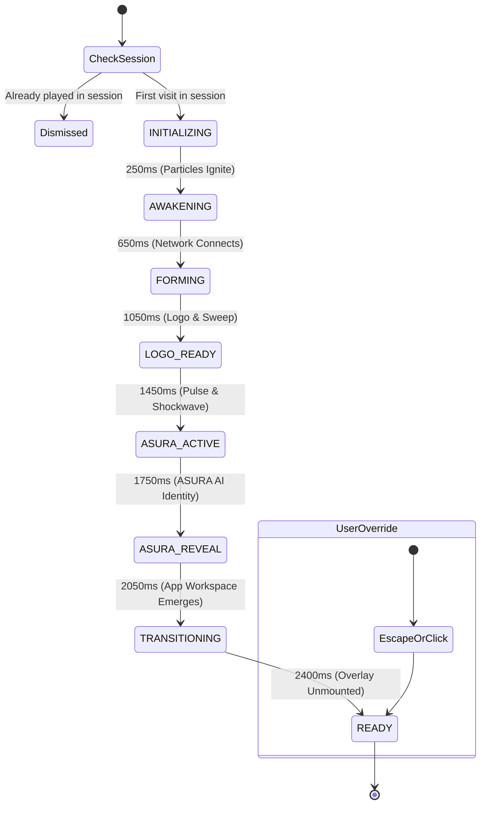

# ASURA AI — Cinematic Opening Animation Specification

> **Document Version:** 1.0.0  
> **Brand Identity:** ASURA AI by CRETIVRA  
> **Live Production:** [https://asura-ai.cretivra.com](https://asura-ai.cretivra.com)  
> **Architecture Directory:** [`frontend/src/components/opening/`](file:///c:/Users/suhas/OneDrive/Desktop/cretivra%20ai/frontend/src/components/opening/)

---

## 1. Executive Overview

The **Asura AI Cinematic Opening Animation** represents the visual awakening of next-generation artificial intelligence. Rather than displaying a conventional loading spinner or static splash screen, the system stages an authentic, physics-driven activation sequence where the **CRETIVRA brand logo serves as the living intelligence core**.

The sequence is designed to feel:
> **"An intelligence is coming online."**

The emotional and conceptual progression follows five seamless milestones:
```text
SIGNAL  ──▶  AWAKENING  ──▶  INTELLIGENCE  ──▶  IDENTITY  ──▶  CONVERSATION
(Particle)   (Orbital Flow)   (Network Core)   (ASURA AI)    (Chat Ready)
```

The animation runs concurrently with real application initialization (theme, authentication, model registry, conversations, and health check) and transitions seamlessly into the ready-to-type chat workspace in under **2.5 seconds**, with zero post-animation delay.

---

## 2. Visual Style & Brand Palette

The visual style is designed to be **premium, intelligent, futuristic, calm, and enterprise-grade**. It strictly avoids aggressive neon glows, gaming tropes, or noisy sci-fi HUDs.

### Color Tokens
Derived directly from the authentic CRETIVRA identity:

| Token Name | Hex Code | Visual Role |
|---|---|---|
| **Deep Space Navy** | `#0f1a36` / `#0a1128` | Primary brand typography, high-contrast text |
| **Royal Network Blue** | `#2563eb` / `#206cf3` | Left lobe geodesic nodes and primary energy streams |
| **Cyan Quantum** | `#06b6d4` / `#1ac9de` | Right lobe geodesic nodes, center particle, and glow sweeps |
| **Cosmic Violet** | `#8b5cf6` | Infinity loop gradient accent, activation pulse bloom |
| **Luminous White** | `#ffffff` | Particle spark centers, high-energy node cores |
| **Atmospheric Light** | `#ffffff` $\rightarrow$ `#edf3fc` | Radial backdrop gradient (`asura-opening-backdrop`) |

---

## 3. Cinematic Phase Breakdown (Timeline)

The sequence operates on a deterministic, millisecond-controlled timeline:

```text
EMPTY SPACE
    │
    ▼ (0.00s – 0.25s)
[01] THE FIRST SIGNAL (Single Luminous Particle)
    │
    ▼ (0.25s – 0.65s)
[02] INTELLIGENCE AWAKENS (Orbital Lemniscate Particles)
    │
    ▼ (0.65s – 1.05s)
[03] ENERGY STREAMS (Geodesic Network Construction)
    │
    ▼ (1.05s – 1.45s)
[04] CRETIVRA LOGO FORMATION (Infinity Core & Sweep)
    │
    ▼ (1.45s – 1.75s)
[05] ASURA ACTIVATION (Breathing Pulse & Shockwave)
    │
    ▼ (1.75s – 2.05s)
[06] ASURA IDENTITY (Typography Blur-Fade Reveal)
    │
    ▼ (2.05s – 2.45s)
[07] CORE EXPANDS INTO APPLICATION (Workspace Emergence)
    │
    ▼ (2.45s+)
[08] READY STATE (Composer Auto-Focused, Instant Typing)
```

---

### Phase Details

#### Scene 01 — The First Signal (0.00s – 0.25s)
* **Backdrop**: Pristine light gradient (`#ffffff` fading out to `#edf3fc`).
* **Visual**: A solitary cyan/blue luminous particle appears at the exact viewport center.
* **Dynamics**:
  - `scale: 0.2 -> 1.0`
  - Soft radial bloom expansion with dual-layer cyan and violet falloff.
  - Represents the initial spark of consciousness.

#### Scene 02 — Intelligence Awakens (0.25s – 0.65s)
* **Visual**: The central signal emits 34 micro-particles.
* **Dynamics**: Particles do not disperse randomly; they travel along smooth orbital lemniscate (figure-eight) trajectories matching the twin lobes of the CRETIVRA infinity loop.
* **Particle Diversity**: Varied radii (1.8px – 3.2px), opacities (0.5 – 0.9), velocities, and subtle dynamic glow trails connecting adjacent particles.

#### Scene 03 — Energy Streams (0.65s – 1.05s)
* **Visual**: Particles begin converging toward the exact coordinates of the **11 primary nodes** in the CRETIVRA logo.
* **Dynamics**: Thin luminous energy lines (`strokeWidth="0.55"`, dual-color gradient) ignite between node pairs, mathematically tracing out the geodesic wireframe lattice.

#### Scene 04 — CRETIVRA Logo Formation (1.05s – 1.45s)
* **Visual**: The authentic CRETIVRA logo mark emerges in full fidelity (`/cretivra-core.png`).
* **Dynamics**:
  - The 11 node positions ignite with staggered luminous pulse dots.
  - An energetic light sweep glides across the infinity path from left to right.
  - Below the mark, the geometric brand name **CRETIVRA** fades in with tracking `0.22em`.

#### Scene 05 — Asura Activation (1.45s – 1.75s)
* **Visual**: The formed CRETIVRA logo becomes the active **Asura Intelligence Core**.
* **Dynamics**:
  - A subtle breathing pulse: `scale: 1.00 -> 1.04 -> 1.00`.
  - Core drop shadow deepens into cyan/violet bloom.
  - A concentric circular shockwave/energy wave expands outward from the center.

#### Scene 06 — Asura Identity (1.75s – 2.05s)
* **Visual**: The Asura brand mark reveals below the core:
  - **ASURA**: Bold, geometric, tracking-tight.
  - **AI**: Gradient pill badge (`cyan-500` to `violet-600`).
  - Subtext: *"Frontier Autonomous Intelligence"*.
* **Dynamics**: `opacity: 0 -> 1`, `translateY: 8px -> 0`, `filter: blur(6px) -> blur(0)`.

#### Scene 07 — The AI Core Becomes the Application (2.05s – 2.45s)
* **Visual**: Seamless transition into the live workspace.
* **Dynamics**:
  - The opening backdrop begins dissolving: `opacity: 1 -> 0`.
  - Application elements smoothly transition into place using hardware-accelerated transforms:
    - Sidebar: `translateX(-15px) -> 0`, `opacity: 0 -> 1`
    - Header & Navigation: `opacity: 0 -> 1`
    - Chat / Command Workspace: `opacity: 0 -> 1`
    - Composer Input: `translateY(10px) -> 0`, `opacity: 0 -> 1`

#### Final State (2.45s+)
* **Overlay**: Completely unmounted from DOM (`isDismissed: true`), consuming 0 memory and 0 CPU cycles.
* **Input**: Automatically focuses the chat composer textarea so the user can begin typing immediately.
* **Zero Delays**: No intermediate spinners or "Loading..." banners.

---

## 4. Mathematical & Physics Foundation

### 1. Lemniscate Orbital Curves
The particle paths follow parametric Lemniscate of Bernoulli equations scaled to the dimensions of the twin infinity lobes:

$$x(t) = c_x + \frac{a \cdot \cos(t)}{1 + \sin^2(t)}$$

$$y(t) = c_y + \frac{b \cdot \sin(t) \cdot \cos(t)}{1 + \sin^2(t)}$$

* $c_x, c_y$: Canvas center coordinates.
* $a$: Horizontal spread factor ($0.42 \times \text{coreWidth}$).
* $b$: Vertical amplitude factor ($0.44 \times \text{coreHeight}$).
* Alternating particles travel clockwise ($+1$) and counter-clockwise ($-1$) to establish fluid kinetic balance.

### 2. Geometric Node Mapping
The 11 primary nodes of the CRETIVRA logo are mapped to relative $[0..1]$ coordinate space:

```text
               (0.272, 0.100)                      (0.728, 0.100)
                    [Top]                               [Top]
                      ●                                   ●
                     / \                                 / \
      (0.052, 0.308)●   \               ●               /   ●(0.948, 0.308)
     (Outer Top-Left)    \         (0.500, 0.500)      /     (Outer Top-Right)
                          \           [Center]        /
     (0.034, 0.500)●───────●─────────────────────────●───────●(0.965, 0.500)
       (Far Left)           \                       /          (Far Right)
                             \                     /
      (0.052, 0.692)●         \                   /         ●(0.948, 0.692)
     (Outer Bot-Left)          \                 /           (Outer Bot-Right)
                                ●               ●
                         (0.272, 0.900)   (0.728, 0.900)
                            [Bottom]         [Bottom]
```

When transitioning from `AWAKENING` to `FORMING`, each particle linearly interpolates from its orbital lemniscate position toward its designated target node:

$$\mathbf{p}_{t+1} = \mathbf{p}_t + (\mathbf{n}_{\text{target}} - \mathbf{p}_t) \times 0.16$$

---

## 5. Component Architecture

All components reside in [`frontend/src/components/opening/`](file:///c:/Users/suhas/OneDrive/Desktop/cretivra%20ai/frontend/src/components/opening/):

```text
src/components/opening/
├── AsuraOpeningAnimation.tsx   # Master orchestrator & deterministic state machine
├── EnergyParticles.tsx         # 60 FPS HTML5 Canvas particle simulation
├── LogoFormation.tsx           # Geodesic network SVG lines & authentic logo core
├── AsuraReveal.tsx             # Intelligence activation pulse & ASURA AI typography
├── AppTransition.tsx           # Application emergence transition wrapper
└── index.ts                    # Clean barrel export
```

### Component Roles

#### `AsuraOpeningAnimation.tsx`
* Implements the 8-state deterministic state machine.
* Manages session lifecycle (`sessionStorage.getItem('asura_opening_played_session')`) to prevent duplicate runs.
* Stabilizes parent callbacks with `useRef` to eliminate re-render loops.
* Implements accessibility (`prefers-reduced-motion: reduce`) and power-user skip (`Escape` / click).

#### `EnergyParticles.tsx`
* High-performance 2D Canvas engine running on `requestAnimationFrame`.
* Handles device pixel ratio (`window.devicePixelRatio`) for retina displays.
* Calculates orbital lemniscate physics and dynamic proximity energy line rendering.

#### `LogoFormation.tsx`
* Renders the authentic transparent PNG core asset ([`public/cretivra-core.png`](file:///c:/Users/suhas/OneDrive/Desktop/cretivra%20ai/frontend/public/cretivra-core.png)).
* Overlays dynamic SVG geodesic lines with soft blur filters.
* Contains the `@keyframes asura-opening-sweep` light beam effect.

#### `AsuraReveal.tsx`
* Renders the concentric expanding shockwave (`asura-animate-ripple`).
* Displays the typography reveal with smooth CSS blur-filter dissipation.

---

## 6. Lifecycle & State Machine



### Session & Guard Mechanics

1. **Session Storage Guard**:
   ```typescript
   sessionStorage.setItem('asura_opening_played_session', 'true');
   ```
   Ensures that switching views (`/`, `/chat`, `/studio`, `/playground`) or refreshing during a session **never** restarts the animation.

2. **Mount Guard (`hasStartedRef`)**:
   Guarantees the sequence executes strictly once on component mount, even if the parent component re-renders when data loads.

3. **Returning User Fast-Track**:
   Users who have previously visited the site (`localStorage.getItem('cretivra_asura_visited') === 'true'`) receive an ultra-fast ~0.65s condensed transition on their first visit of a new session.

4. **Manual Replay Capability**:
   Users can replay the full cinematic awakening at any time by clicking the **ASURA** brand title in the header or the **Sparkles** icon in the top-right toolbar.

---

## 7. Performance & Accessibility Standards

* **Frame Rate**: Locked at **60 FPS** on standard desktop hardware using `requestAnimationFrame`.
* **Hardware Acceleration**: Only `transform: translate3d(...)` and `opacity` are animated during transition phases; zero layout-thrashing properties (`width`, `height`, `margin`, `top`, `left`) are animated.
* **Canvas Optimization**: Particle paths are calculated parametrically without heavy physics libraries or Three.js bundle overhead.
* **Zero Blocking**: All network requests, model registry fetching, and authentication run concurrently in the background during the 2.4s sequence.
* **Reduced Motion Compliance**: When `prefers-reduced-motion: reduce` is enabled in the user's OS, the canvas particle system and motion transforms are disabled, showing a calm, static 0.4s fade of the CRETIVRA logo into the application.
