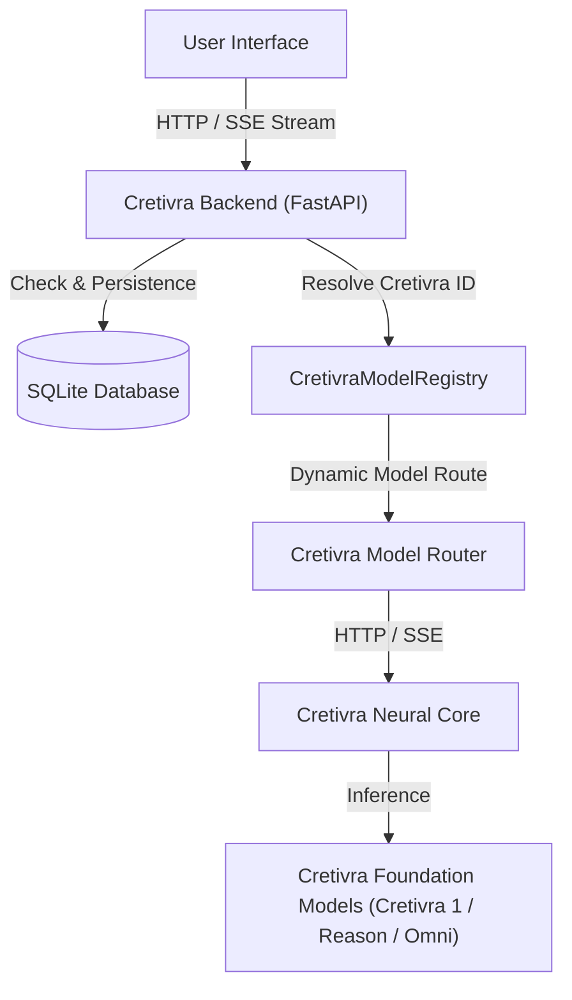
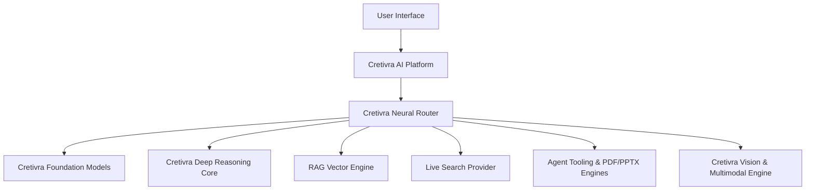

# CRETIVRA AI — System Architecture

Cretivra AI is built as a frontier and local-first, privacy-respecting AI platform architecture powered by the Cretivra Neural Core and a unified model registry.

## High-Level Data Flow

## Unified Multi-Engine Architecture

## Component Architecture

1. **Frontend (React 19 + TypeScript + Vite + Tailwind CSS)**:
   - Dynamic prompt composer with multiline auto-expansion.
   - Cretivra Model selector showcasing unified Cretivra model tiers.
   - Real-time SSE streaming reader with AbortController for stop generation.
   - Grouped chat history (Today, Yesterday, Previous 7 Days, Older) with local search.
   - Compact reasoning status indicator for Cretivra Reason model.

2. **Backend (Python + FastAPI + SQLAlchemy + Pydantic)**:
   - `CretivraModelRegistry`: manages Cretivra IDs (`cretivra-1`, `cretivra-reason`, `cretivra-omni`, etc.) and dynamic runtime capabilities.
   - `CretivraProvider`: asynchronous streaming provider supporting SSE streams, health checks, and fallback simulation mode.
   - `FileService`: validation, parsing, and text extraction for PDF, DOCX, TXT, CSV, MD, PNG, JPG, WEBP formats.
   - `PDFService`: publication-grade PDF document synthesis engine with running headers, footers, and table rendering.
   - `ConversationService`: CRUD operations, message editing (re-branching), regeneration, and concise title generation.
